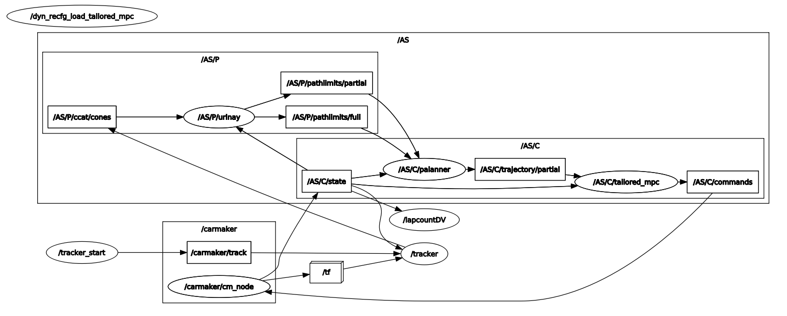

 

<h3 align="center">IPG-ROS workspace</h3>

        BCN eMotorsport
  

    
Table of Contents

    <ol>
        <li>
        <a href="#introduction">Introduction</a>
        </li>
        <li>
        <a href="#disclaimer">Disclaimer</a>
        </li>
        <li>
        <a href="#dependencies">Dependencies</a>
        </li>
        <li>
        <a href="#cm-node">CM Node</a>
        </li>
        <li>
        <a href="#tracker">Tracker</a>
        </li>
        <li>
        <a href="#others">Others</a>
        </li>
        <li>
        <a href="#workflow">Workflow</a>
        </li>
        <li>
        <a href="#parameters">Parameters</a>
        </li>
        <li>
        <a href="#noise">Noise</a>
        </li>
        <li>
        <a href="#known-errors">Known Errors</a>
        </li>
    </ol>

# Introduction
Here you can find the ROS workspace used for ROS + IPG simulation. The way this simulation works is quite simple. IPG CarMaker software is based on some pre-compiled _c/c++_ libraries. The way IPG lets us connect our ROS environment to their simulation workflow is through what they call the __CMRosIF__ (Car Maker ROS Interface). This interface is basically a shared library so we can override the functions we know IPG will call before, during or after the simulation. We can find this interface in [cmrosutils](/src/cmrosutils/).

# Disclaimer
If you use this simulation pkgs the **only** thing I ask for is to **ALWAYS REFERENCE** the team ___BCN eMotorsport___.

# Dependencies
* [Ubuntu](https://ubuntu.com/) 20.04
* [ROS](https://www.ros.org/) Noetic
* [Eigen3](https://eigen.tuxfamily.org)
* [IPG CarMaker](https://www.ipg-automotive.com/en/products-solutions/software/carmaker/) license.

# CM Node
This pkg is the one to change if some new functionalities are needed. Within this node a class which inherits from `CarMakerROSInterface` have been declared. Inside this class we override some of the functions that IPG library calls. 

This node is the one that enables us to access to all the IPG simulation data as well as to include user-defined functions into the internal logic of the simulation.

For now on the most relevant CM jobs defined are:

* Publishers (`CMJob::RosPublisher`):

    * CAR STATE: this job is defined so we can retrieve car state information from IPG data and publish it via __/carmaker/state__. We also publish _base_link_ TF with this data.
    * LIDAR: this job is defined so we can retrieve the LIDAR sensor pointcloud and publish it via __/carmaker/pointcloud__. We also get the current LIDAR position relative to the car and publish a _lidar_ TF.

* Subscribers (`CMJob::RosSubscriber`):

    * COMMANDS: we define two jobs for car commands subscribers. One is listening to __/AS/C/commands__ topic for _throttle_ commands and the other one to __/AS/C/steering__ for _steering_ commands. If only one controller for throttle AND steering is used [Config/LateralCtrl](src/cmnode/params/cmnode.yaml) should be false. Steering + Throttle should be published on __/AS/C/commands__.

Have a look at [cmode.h](src/cmnode/include/cmnode.h) for more information.

# Tracker
This pkg is the one that publishes the chosen Track/Circuit as well as it keeps track of seen cones (that's why its called that way :) ). The main idea for this pkg is to be able to simulate the AS Control pipeline without using the LiDAR raw data from IPG. It is an "elegant" way of keeping the simulation light (so it can be used in a low performance computer) and having similar results. 

__NOTE:__ If simulated LiDAR raw data is needed for some reason a LiDAR RSI sensor must be defined using IPG GUI. This repo holds the necessary code to be able to detect whether a LiDAR is being used and publish its raw data via __/carmaker/pointcloud__ topic.

This pkg is divided into two different nodes:

* [tracker_start](/src/tracker/scripts/start.py): it reads the chosen track from the [yaml files](/src/tracker/tracks/) and publishes its cones in __/carmaker/track__. It is defined in [start.py](/src/tracker/scripts/start.py).

* [tracker](/src/tracker/src/main.cpp): it reads the whole track published by _tracker_start_ and fakes a perception pipeline so the cones keep appearing depending on the car's position and orientation. There are some parameters to adapt this faking perception pipeline to your needs: `radius`, `vision_angle` and `likelihood`. You can find them [here](src/tracker/params/tracker.yaml). You can also add some gaussian error to this cone appearance in order to improve its correlation with a real perception pipeline of BCN eMotorsport :)

This pkg also has THE launch file called by IPG when its GUI is started. [This launch file](/src/tracker/launch/tracker.launch) runs both nodes and sets all necessary parameters.

_EXTRA_: This pkg also keeps count of the hit cones ( via __/carmaker/conesdown__ ) and it has its own lapcount, meaning it publishes the laptimes updating them with the penalties for each cone down (+2s). This laptime is published in __/carmaker/lapinfo__. Finally, it also updates the cones positions if they're hit by the car (just because its cool). The moving cones are published by [tracker_start](/src/tracker/scripts/start.py), a node ment to run at a really low freq. If you want to get a fancy and faster update of the moving cones increase its frequency.  

# Others
Other pkgs just like [camera_msgs](/src/vehiclecontrol_msgs/) or [carmaker_rsds_client](/src/carmaker_rsds_client/) are currently not used. They are kept within this repo in order to be used in a near future.

# Workflow
Here you can see an example workflow of this workspace with tracklimits, planner and controller algorithms running (_urinay_, _palanner_ and _tailored_mpc_ respectively).

# Parameters
Here you can find an explanation to the multiple parameters set for this simulation as well as the different launch files. The explanation will be in order of execution.

1. [tracker.launch](/src/tracker/launch/tracker.launch) : This is the main launch file called by IPG when `Extras` > `CMRosIF` > `Launch & Start Application` is clicked. Within this launch file we can find the following parameters:
    * _track_name_ : where you have to specify the track you want to run. All available tracks are inside [tracks](/src/tracker/tracks/) folder. Have a look and choose one :).
    * _use_sim_time_ : pre-defined ROS param. We set this to `true` as we want IPG to have control over ROS time, so we can stop (_F2_) and restart the simulation.

    This launch file also runs `tracker_start` & `tracker` nodes (see [Tracker](#tracker) section for more info). 

    * _Topics_ : Input & Output topics
    * _Service_ : Srv topic name
    * _Noise_ : Mean and Std for the added Gaussian error to the cone positions.
    * _Detection_ : Cone detection _Radius_, _VisionAngle_ and _Likelihood_ for the fake perception pipeline.
    * _Lapcount/MinVel_ : Lapcount parameters (min vx to consider the car started moving).
    * _BoundingBox_ : BB for car-cone collision check. Different from vehicle dynamics car dimensions in that these should include aerodynamic devices.
    * _ConesMoving_ : whether you want to move the hit cones.
    * _cone_daes_ : Whether we want to visualize the cones .dae files. If false, cones markers will be cylinder shaped.
    * _freq_ : [start.py](/src/tracker/scripts/start.py) frequency. If you want to move cones when they're hit by the car, you should increase this frequency up to 10Hz. 

3. [cmnode.launch](/src/cmnode/launch/cmnode.launch) : This launch file sets the [cmnode.yaml](/src/cmnode/params/cmnode.yaml) file to the param ROS srv. Within this yaml file we can find the following parameters:
    * _Config_ :
        * _LateralCtrl_ : whether we are using a high level lateral control pipeline or not. In other words, if we are using two different AS controller (longitudinal and lateral) or we have a coupled solution (one only controller).
        * _Driver_ : whether we want to use the IPG driver or not (`true` for manual or `false` for autonomous).
        * _HidraulicBrake_ : whether we want to use Hidraulic Braking or not.
        * _EBS_ : whether we want to switch on EBS braking when in finish state or not.
        * _LLC_ : whether we are simulating with Low Level Control : 
            * 0 == false.
            * 1 == motor control via torque commands.
            * 2 == motor control via angular velocity commands.
        * _4WD_ : whether we are using 4 Wheel Drive (`true`) or 2 Wheel Drive (`false`).

    * _Noise_ : Mean and standard deviation for the added Gaussian noise to the sensors.

    * _Steering_ : Here we can find the MAX and MIN dynamic limits of the steering (in wheel frame). These are needed because IPG steering controllers need the commands in steering wheel frame, so a linear interpolation from high level controller commands (wheel frame) to final steering wheel angle is made.

    * _Subscribers_ : Here we can find all the topics that [cmnode](/src/cmnode/) will be subscribed to. For each topic we have its value (string) and its frequency (yes, in IPG we must specify a cycle time for subscribers).

    * _Publishers_ : Same as _Subscribers_ but for all the topics that [cmnode](/src/cmnode/) will be publishing.

# Noise
IPG sensors have very little error, in fact you can actually integrate/derivate their IMU/Odom data and expect to have accurate results on velocity/position estimation. That's not possible with real car data. Because of that, __Gaussian__ noise (Random Walk) is added to IMU and Odom sensors in order to work with a more realistic environment.

For the moment only __/carmaker/state__ topic has this Gaussian noise added to its velocity and acceleration output.

A part from that, Gaussian noise is also added to the "detected" cones seeking a better correlation with a real perception pipeline.

# Known Errors
Here all known errors/issues will be written down with their solution (if it can be solved ;) ).

## ⚠ Time-out
Sometimes (after simulating for a long time) IPG GUI starts to lag and time-out errors raise as it is taking so long to start the application.

    

Solution:
* Open Ubuntu `System Monitor` program and look for `CarMaker.linux64` process. There should be only one process called that way. If there are more than one __end all processes__ called that way and restart IPG GUI.

## ⚠ New node registered with same name [cmnode]

A ROS warning with this message:

`[ WARN] [1680943413.460482209]: Shutdown request received.`

`[ WARN] [1680943413.461420181]: Reason given for shutdown: [[/carmaker/cm_node] Reason: new node registered with same name]`

 is printed in the terminal where `./CMStart.sh` is run and you cannot start the simulation because of a CarMaker time-out error. 

Solution:
* Open Ubuntu `System Monitor` program:
    * Look for `CarMaker.linux64` process. There should be only one process called that way. If there are more than one __end all processes__ called that way and restart IPG GUI.
    * Look for a process called `apobrokerd`. If there is a process called that way, probably Ubuntu has killed IPG simulation because something wasn't working as expected. __End this process__.
* If the above solution doesn't work, the last thing to do is reseting your computer. This always fix this issue.

__NOTE:__ An alternative of openning `System Monitor` is running `pkill` command on a new terminal specifying the name of the process you want to end/kill.